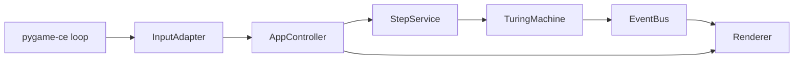
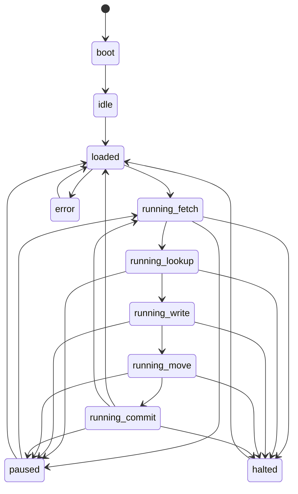
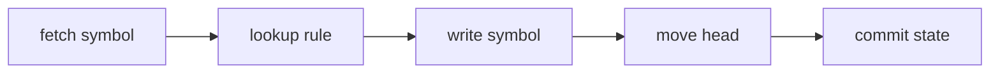

# Architecture Guide

[Back to README](../README.md) | [User Guide](user-guide.md) | [Spec Reference](spec-reference.md) | [Contributing Guide](contributing.md)

## Overview

The project is structured around a strict separation between:

- the **Turing machine domain**
- the **simulator application shell**

The domain is plain Python logic. The app shell handles interaction, timing,
hierarchical state transitions, rendering, and event publication.

## Package Responsibilities

| Package | Responsibility |
| --- | --- |
| `tmviz.app` | Commands, controller state machine, app events, step orchestration |
| `tmviz.domain` | Tape, moves, rules, machine configuration, halting semantics |
| `tmviz.factory` | JSON normalization, validation, and machine construction |
| `tmviz.infra` | Spec loading, logging bootstrap, synchronous event bus |
| `tmviz.ui` | Pygame renderer, layout budgeting, theme, and input mapping |

## Entry Point

`tmviz.main` is the desktop bootstrap layer.

It is responsible for:

- initializing `pygame`
- creating the resizable window
- loading bundled spec paths
- creating `EventBus`, `AppController`, `InputAdapter`, and `Renderer`
- handling the top-level event loop
- forwarding `VIDEORESIZE` and keyboard events
- calling `controller.update()` and `renderer.render()` each frame

## Controller Lifecycle

`AppController` wraps a `transitions.extensions.HierarchicalMachine`.

Top-level states:

- `boot`
- `idle`
- `loaded`
- `running`
- `paused`
- `halted`
- `error`

Running sub-phases:

- `running_fetch`
- `running_lookup`
- `running_write`
- `running_move`
- `running_commit`

Notes about the real controller behavior:

- `fail` can send the controller to `error` from any state.
- `reset_to_loaded` is allowed from `loaded`, `paused`, `halted`, `error`, and
  running substates.

## Step Pipeline

The simulator exposes a full machine transition as a staged pipeline.

`StepService` coordinates the staged work and emits app events:

1. `fetch`
2. `lookup`
3. `write`
4. `move`
5. `commit`

The underlying domain machine mirrors that split:

- `prepare_step()`
- `apply_write_phase()`
- `apply_move_phase()`
- `commit_prepared_step()`

This allows the UI to display sub-phases even though a Turing machine
transition is still mathematically deterministic.

## Domain Model

The core runtime machine is `TuringMachine`.

Key responsibilities:

- hold the current control state
- hold the sparse tape
- hold the current head position
- look up rules by `(state, symbol)`
- apply writes and movements
- track halt state and halt reason

Supporting domain types:

- `Tape`: sparse tape backed by a dictionary with an implicit blank symbol
- `Rule`: one transition-table entry
- `Direction`: `L`, `R`, or `S`
- `MachineConfiguration`: normalized, validated machine config
- `PreparedStep` and `StepResult`: structured transition data

## Event Flow

The event bus is intentionally tiny and synchronous.

It is used to:

- publish controller state changes
- record step-level events for the event rail
- decouple orchestration from display concerns

Event history is retained in a bounded list and surfaced through
`ControllerSnapshot`.

## Rendering Model

The current UI is a dense terminal-style scene made of measured layout regions:

- HUD
- tape field
- inspector
- event rail

`build_scene_layout()` computes those regions from window size and measured font
metrics. The renderer uses clipping, wrapping, and ellipsis to prevent overlap.

## Extension Points

Good places to extend the project:

- add new JSON machines in `specs/`
- add new validator rules in `tmviz.factory`
- add new controller commands or events in `tmviz.app`
- evolve the renderer or theme in `tmviz.ui`

If you add a new simulator behavior, update both the docs and the corresponding
tests in the same change.
