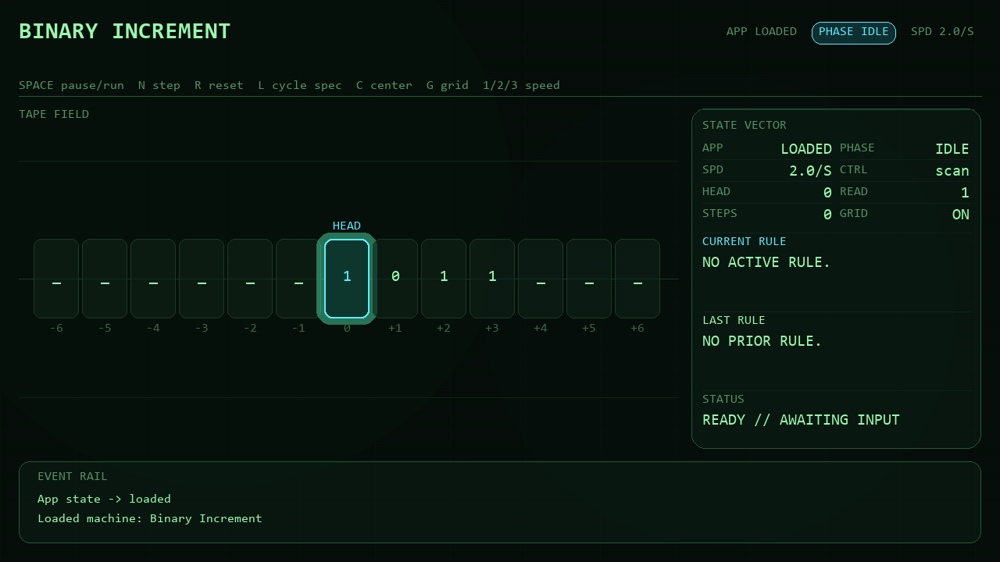
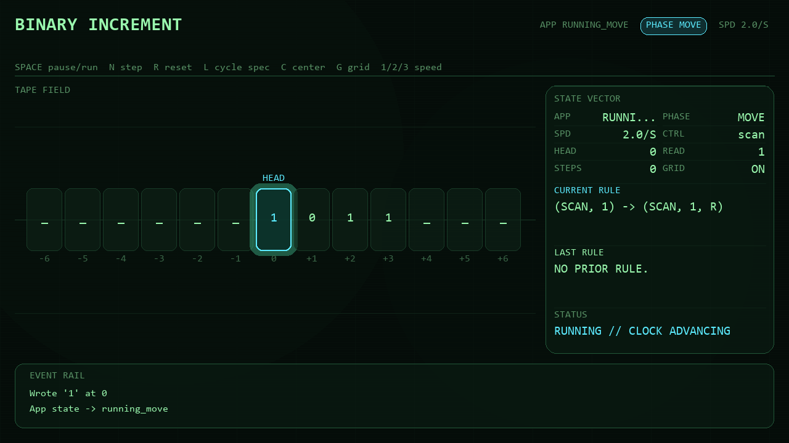
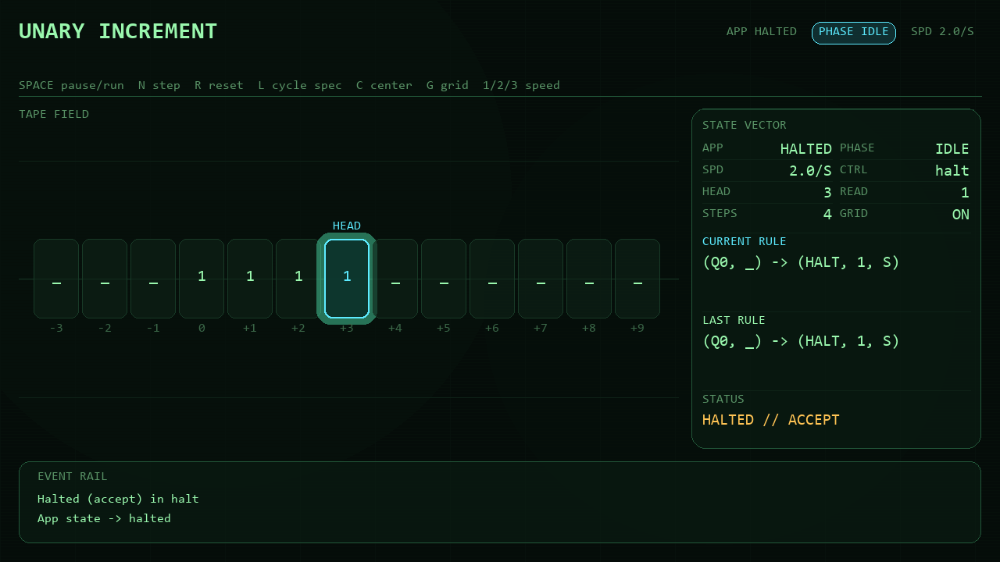

# User Guide

[Back to README](../README.md) | [Spec Reference](spec-reference.md) | [Architecture Guide](architecture.md) | [Contributing Guide](contributing.md)

## Overview

The simulator is a desktop app for exploring how a Turing machine evolves over
time. It opens with a bundled machine already loaded, lets you single-step the
machine or run it continuously, and keeps the active rule, state, tape head,
and recent events visible.



## Launching The App

From an activated virtual environment:

```bash
python -m tmviz
```

You can also launch it via the installed entry point:

```bash
tmviz
```

The window is resizable and clamps to a minimum of `960x600`.

## Reading The Interface

### HUD

The top HUD shows:

- machine name
- current app state
- current running phase
- configured speed
- key hints

### Tape Field

The tape field is the main workspace.

- The highlighted cell is the current head position.
- The symbol inside each cell is the visible tape content.
- The index below each cell shows the tape coordinate.
- The tape window is a preview slice around the head, not the whole infinite tape.

### Inspector

The inspector on the right is split into three areas:

- **State vector**: app state, phase, speed, control state, head, read symbol, step count, and grid toggle state
- **Rule blocks**: current rule and last rule
- **Status block**: ready, running, halted, or error summary

### Event Rail

The event rail shows the most recent simulator events. Typical entries include:

- machine loaded
- symbol read
- rule selected
- symbol written
- head moved
- step committed
- machine halted

## Keyboard Controls

| Key | Action |
| --- | --- |
| `Space` | Toggle run / pause |
| `N` | Execute one complete transition |
| `R` | Reset the currently loaded machine |
| `L` | Cycle to the next bundled machine spec |
| `C` | Publish and log a center-head event |
| `G` | Toggle grid rendering |
| `1` | Set speed to `1.0` steps/sec |
| `2` | Set speed to `2.0` steps/sec |
| `3` | Set speed to `5.0` steps/sec |
| `Esc` | Quit |

## Typical Workflow

### Inspect a machine before running it

1. Launch the app.
2. Look at the loaded machine name in the HUD.
3. Inspect the current state vector and current tape window.
4. Press `L` to cycle through bundled machines if needed.

### Step through a machine carefully

1. Press `N` to run one full transition.
2. Watch the event rail update through the `fetch -> lookup -> write -> move -> commit` pipeline.
3. Compare the current rule and last rule blocks after each step.

### Run continuously

1. Press `Space` to start running.
2. Use `1`, `2`, or `3` to change the step rate.
3. Press `Space` again to pause.

## Bundled Demo Machines

### Unary Increment

- easiest machine to understand visually
- starts with `111_`
- halts with `1111`

### Binary Increment

- demonstrates carry logic
- moves right to scan the tape, then left to propagate carry
- useful for verifying the rule inspector and phase transitions

### Busy Beaver (2 State)

- intentionally tiny rule set
- visibly grows the tape quickly
- useful for seeing how the event rail and head movement behave

## Halted And Error States

When a machine halts, the status block switches to a halt summary such as
`HALTED // ACCEPT` or `HALTED // NO_RULE`.

When a load or runtime failure occurs, the app enters the error state and the
status block shows the error message. Common cases include:

- invalid spec files
- unknown symbols or directions in a spec
- missing runtime rules when `missing_rule_policy` is `error`





## Related Docs

- For JSON machine schema details, see [Spec Reference](spec-reference.md).
- For internal architecture and state flow, see [Architecture Guide](architecture.md).
- For local setup, tests, and contribution workflow, see [Contributing Guide](contributing.md).
